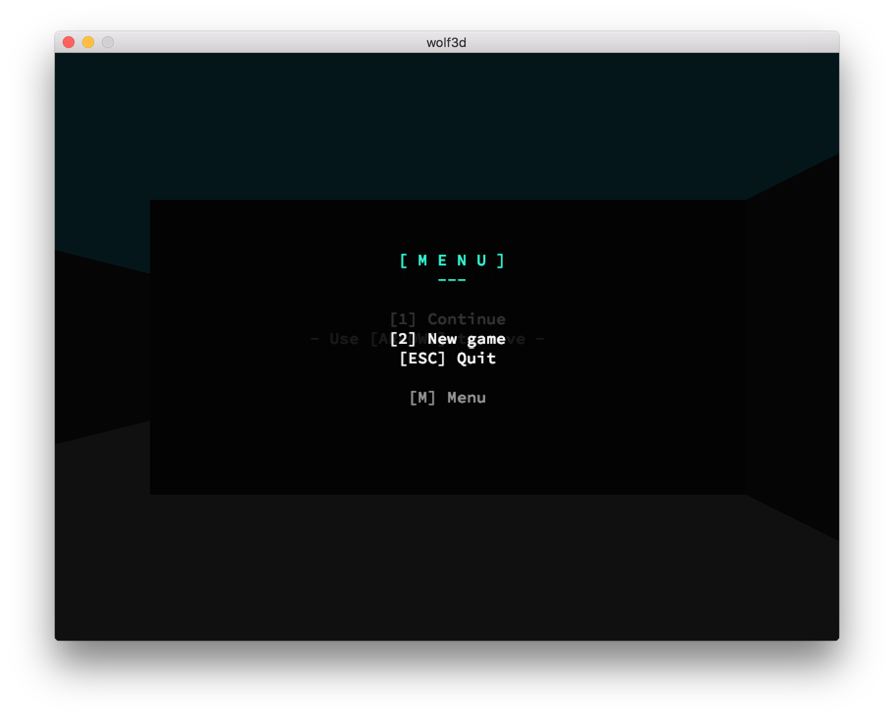
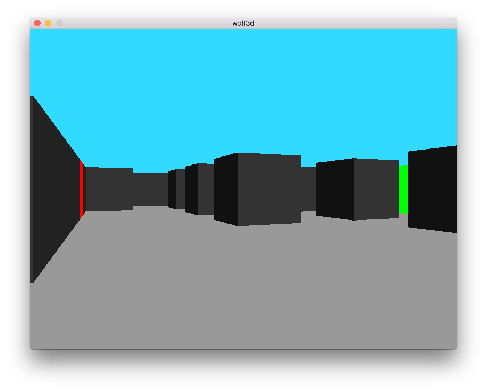
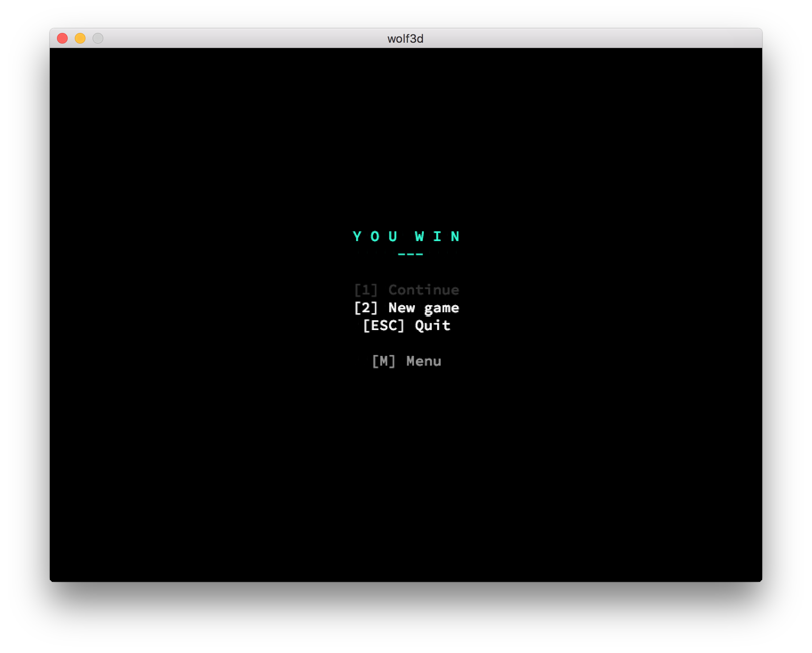

# 42 Labyrinth

## Description

This is a FPS like inspired by the Wolfenstein 3D's game using ray-casting algorithm;
The goal of this project was to represent a dynamic view of a labyrinth and move into it;
I turn it into a little game, you have to find the way out !

### Features

* Menu
* TXT file map
* Collision
* Fast mode
* Save last position
* Sounds effect

### Environment

* Mac OSX

## Dependencies

* MinilibX

### Installation

``` bash
$> wget http://files.achedeuzot.me/42/mlx/mlx-macosx-sierra-2016-10-17.tgz
$> tar -xzf mlx-macosx-sierra-2016-10-17.tgz
$> cd minilibx_macos
$> make
$> sudo cp mlx.h /usr/X11/include
$> sudo cp libmlx.a /usr/X11/lib
```

You can remove the .tgz and the minilibx_macos folder

## Launch binary

``` bash
$> make fclean && make && ./wolf3d
```

## How to play (key event)

* [Up] = MOVE UP
* [Down] = MOVE DOWN
* [Right] = MOVE RIGHT
* [Left] = MOVE LEFT
* [S] = Speed x2
* [M] = MENU
* [1] = CONTINUE
* [2] = NEW GAME
* [SPACE] = ACTION
* [ESC] = QUIT

## Media





## Authors

Xavier Pouzenc
xpouzenc@student.42.fr
